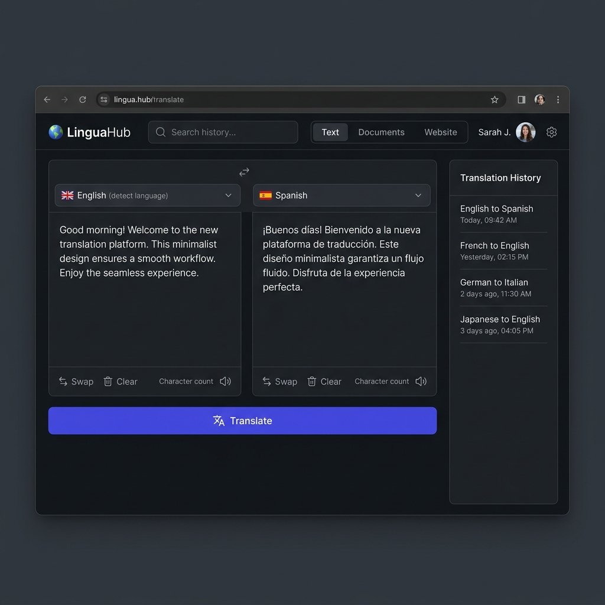

# LinguaGen: Language Translation Tool

<div align="center">
  
</div>

LinguaGen is a modern, responsive web application for seamless real-time language translation. Built with React, Vite, and Tailwind CSS, it offers a premium user experience featuring automatic language detection, text-to-speech capabilities, a persistent translation history, and dark mode support.

## Features

- **Instant Translation**: Real-time translation supporting over 14 languages using the MyMemory API.
- **Auto-Detection**: Automatically detects the source language of your text.
- **Text-to-Speech (TTS)**: Native browser TTS integration to read out translated text with corresponding language accents.
- **Translation History**: Automatically tracks your last 20 translations. History is saved locally and beautifully formatted for easy access.
- **Export & Copy**: One-click actions to copy translations to your clipboard or download them as `.txt` files.
- **Premium UI/UX**: Designed with Tailwind CSS, featuring smooth micro-animations, a strict responsive layout (prevents unwanted scrolling on desktop while stacking neatly on mobile), and an Indigo color accent theme.
- **Dark Mode**: Fully supported dark/light theme toggle.

## Tech Stack

- **Frontend Framework**: React 18
- **Build Tool**: Vite
- **Language**: TypeScript
- **Styling**: Tailwind CSS
- **Icons**: Lucide React
- **API**: MyMemory Translation API

## Getting Started

### Prerequisites
- Node.js (v16 or higher)
- npm or yarn

### Installation

1. Clone the repository:
```bash
git clone https://github.com/abakaushik-lgtm/LanguageTranslationTool.git
cd LanguageTranslationTool
```

2. Install dependencies:
```bash
npm install
```

3. Start the development server:
```bash
npm run dev
```

4. Open your browser and navigate to the URL provided by Vite (usually `http://localhost:5173`).

### Environment Variables

The project is currently configured to use the free MyMemory Translation API which requires no API key.

If you ever wish to switch back to Azure Cognitive Services, you can define your credentials in a `.env` file in the root directory:

```env
VITE_TRANSLATOR_API_KEY=your_azure_api_key_here
VITE_TRANSLATOR_REGION=your_azure_region_here
```
*(Note: You will also need to update the API endpoint logic in `src/services/translatorApi.ts`)*

## Usage

1. **Select Languages**: Choose your target language from the top bar. You can leave the source language on "Detect Language".
2. **Translate**: Type or paste your text into the left panel and click the **[ Translate ]** button.
3. **Listen**: Click the speaker icon to hear the text spoken aloud.
4. **History**: View past translations on the right panel. Click the star icon to favorite them, or the trash can to clear non-favorited items.

## License

This project is licensed under the MIT License.
